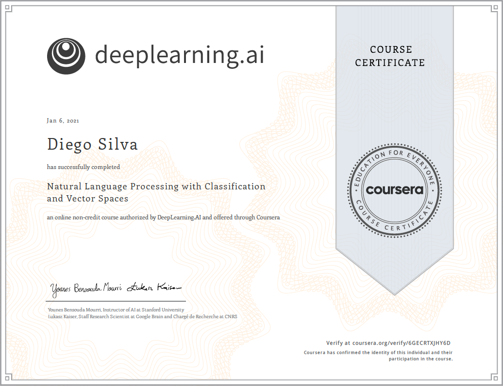

# Deeplearning.ai Natural Language Processing
This repository contains my work of course 1 and 2 of NLP Specializations [Deeplearning.ai NLP Specialization](https://www.coursera.org/specializations/natural-language-processing?=&page=1)
The two courses are:
1. [Course 1: Classification and Vector Space](https://www.coursera.org/learn/classification-vector-spaces-in-nlp?specialization=natural-language-processing)
2. [Course 2: Probabilistic Model](https://www.coursera.org/learn/probabilistic-models-in-nlp?specialization=natural-language-processing)
3. [Course 3: Sequence Models](https://www.coursera.org/learn/sequence-models-in-nlp?specialization=natural-language-processing)
# My NLP Specialization Certification

